# NotesAides Architecture

Last updated: 2026-04-29
Scope: Architecture-only view (system structure, runtime flows, data model, and deployment topology).

## 1. System Context

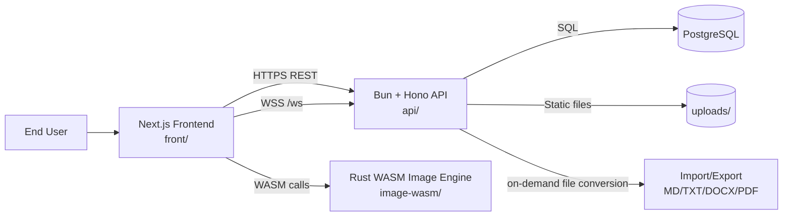

## 2. Monorepo Architecture

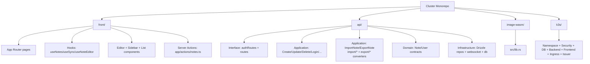

## 3. Runtime Component Topology (Local Dev)

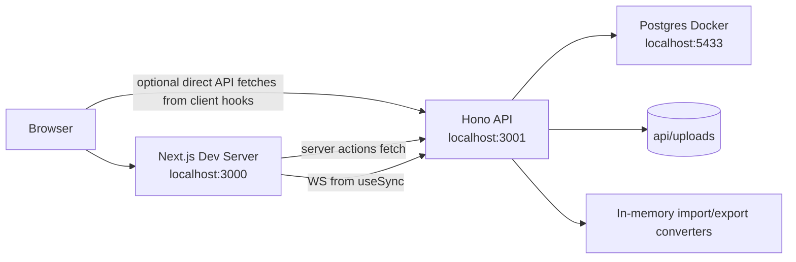

## 4. Authentication and Session Flow

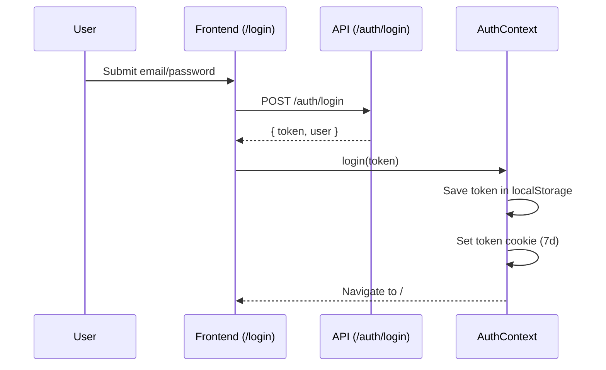

## 5. Note Edit and Auto-Save Flow

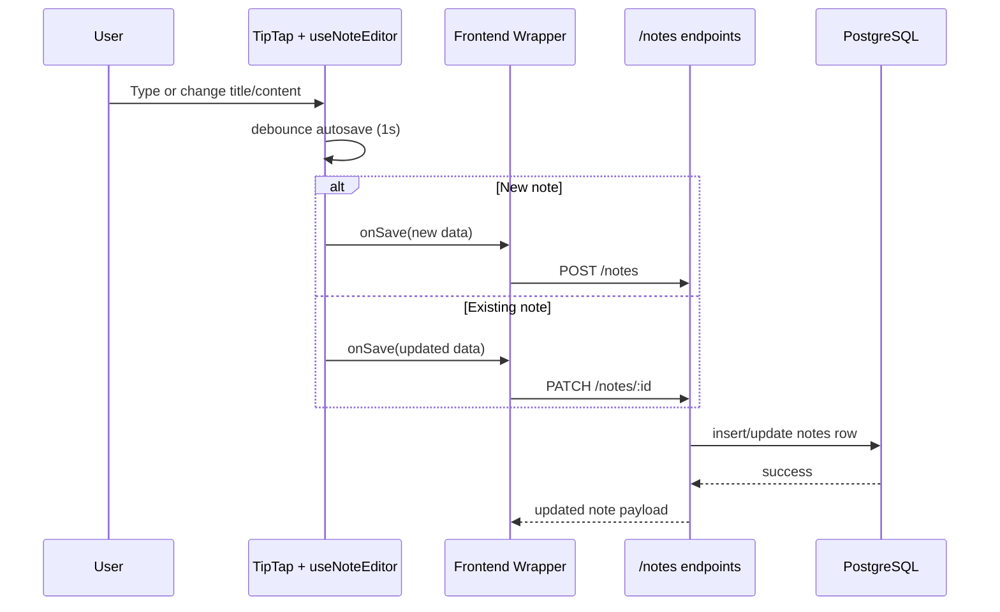

## 6. Real-Time Sync Flow

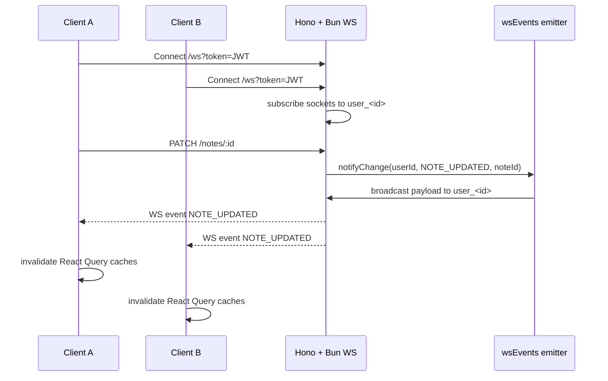

## 7. Image Processing and Upload Pipeline

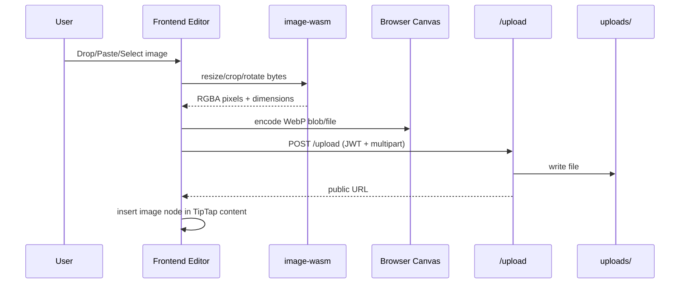

## 8. Note Import Flow

```mermaid
sequenceDiagram
    participant U as User
    participant FE as Frontend
    participant API as POST /notes/import
    participant Import as ImportNoteUseCase
    participant Create as CreateNoteUseCase
    participant DB as PostgreSQL
    participant WS as WebSocket bus

    U->>FE: Select .md/.txt/.docx file
    FE->>API: multipart file + optional tags/folderId
    API->>Import: validate and convert bytes to TipTap JSON
    Import->>Create: create normal note
    Create->>DB: insert note row and metadata
    API->>WS: NOTE_CREATED
    API-->>FE: created note payload
```

Import is not a separate persistence model. Imported files are converted into normal notes and then stored in the existing `notes` table.

## 9. Note Export Flow

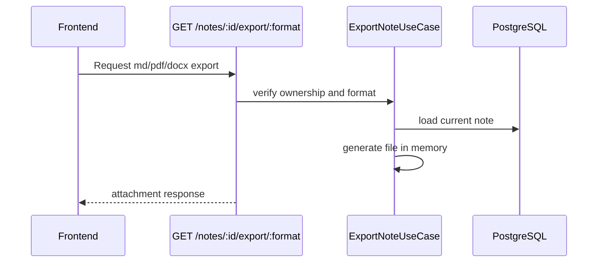

Exports are generated on demand. The API does not store generated Markdown/PDF/DOCX files in PostgreSQL or `uploads/`.

## 10. Data Model (Logical)

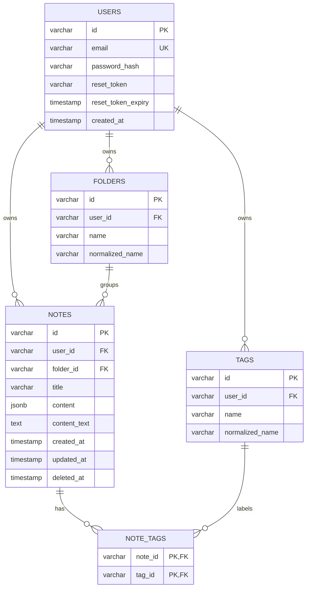

## 11. Deployment Topology (k3s)

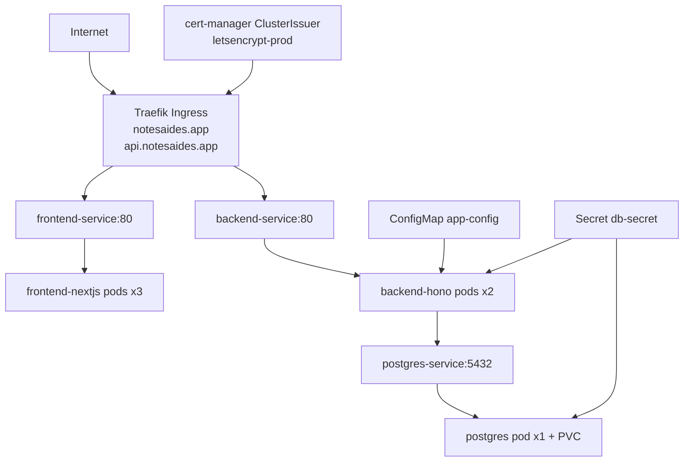

## 12. Container Build Architecture

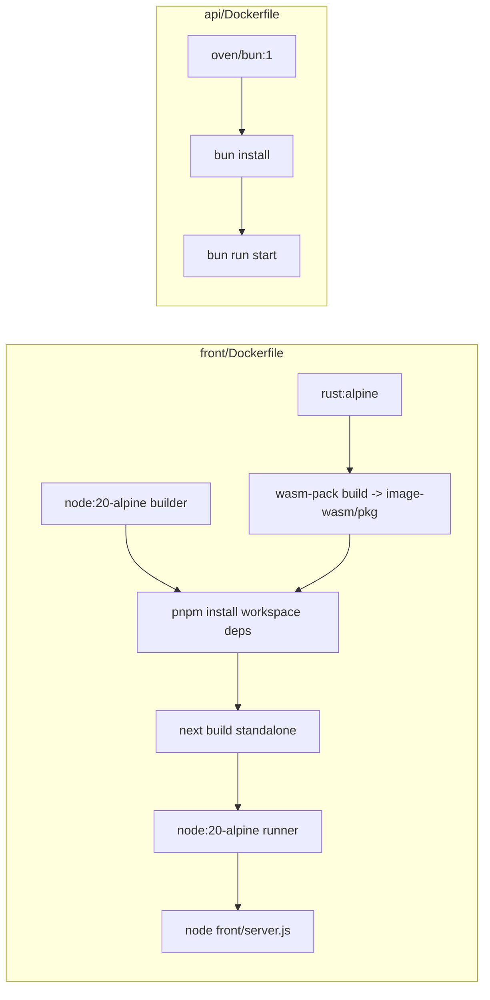

## 13. Architecture Decisions (Current)

- Rich note content is persisted as JSONB, not HTML.
- Soft-delete is first-class (`deleted_at`), with explicit restore/permanent-delete APIs.
- Real-time sync is event-driven via websocket broadcasts scoped per user.
- Image processing is done client-side through Rust WASM for responsiveness and server offload.
- Import creates normal note records from uploaded Markdown, text, and DOCX files.
- Export is stateless and generated in memory for Markdown, PDF, and DOCX responses.
- Frontend uses both server actions and client-side mutations; this works but creates a dual-write-path architecture.

## 14. Known Architecture Gaps

- Planned AI/vector-search architecture in `Prototype.md` is not yet implemented.
- Password reset token generation has no email delivery pipeline.
- Auth token is JS-readable (cookie + localStorage), not HttpOnly-session based.
- Frontend depends on generated `image-wasm/pkg`; clean environment setup requires WASM build step.
- Import/export fidelity is practical rather than perfect: DOCX import extracts raw text, PDF export uses readable text layout, and Markdown conversion covers common editor structures.

## 15. Quick Navigation

- System entrypoint: `api/src/index.ts`
- Note routes: `api/src/interface/routes.ts`
- Auth routes: `api/src/interface/authRoutes.ts`
- DB schema: `api/src/infrastructure/db/schema.ts`
- Import use case: `api/src/application/ImportNote.ts`
- Export use case: `api/src/application/ExportNote.ts`
- Front providers: `front/src/app/providers.tsx`
- Editor core: `front/src/hooks/useNoteEditor.ts`
- Sync hook: `front/src/hooks/useSync.ts`
- WASM exports: `image-wasm/src/lib.rs`
- k3s ingress: `k3s/05-ingress.yaml`
