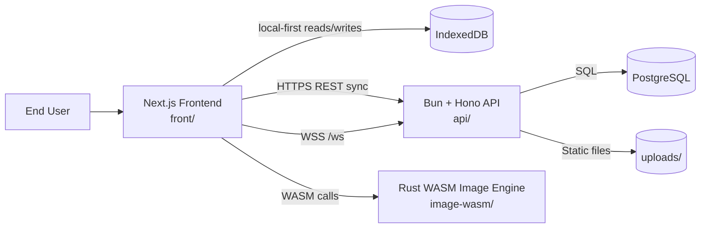
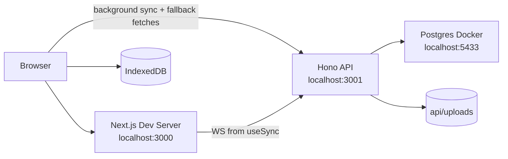
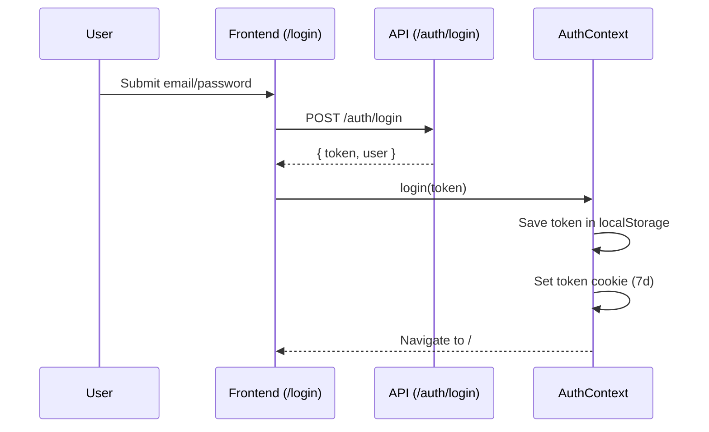
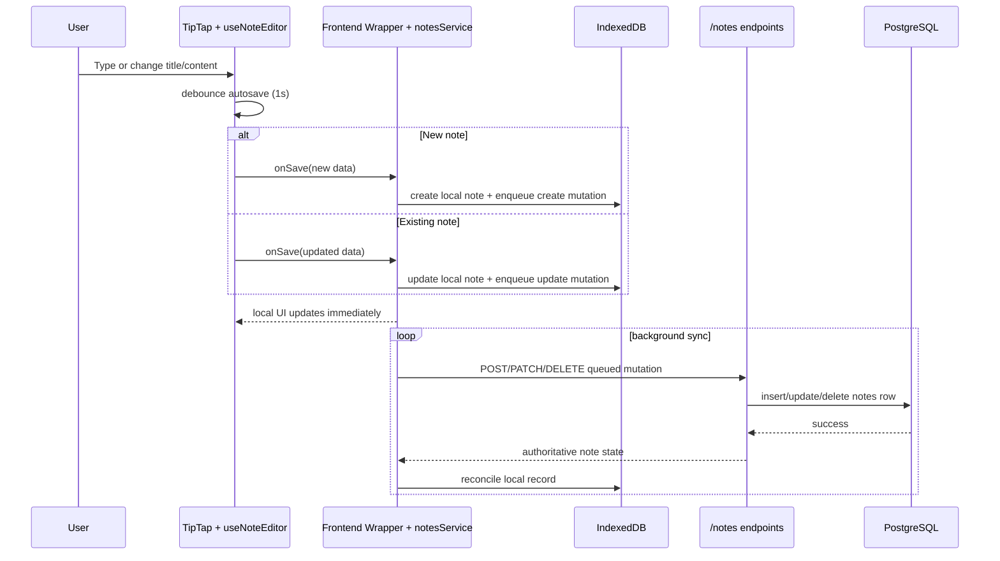
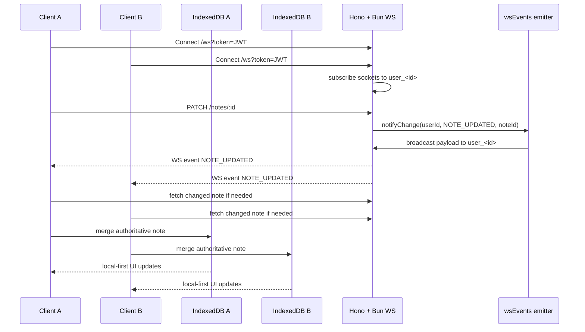
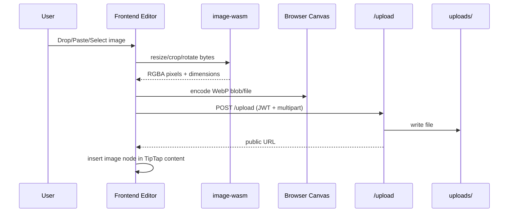
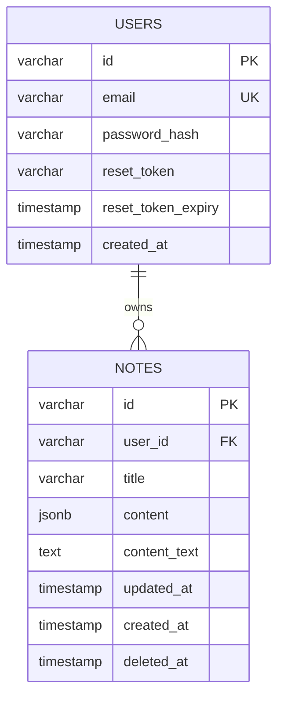
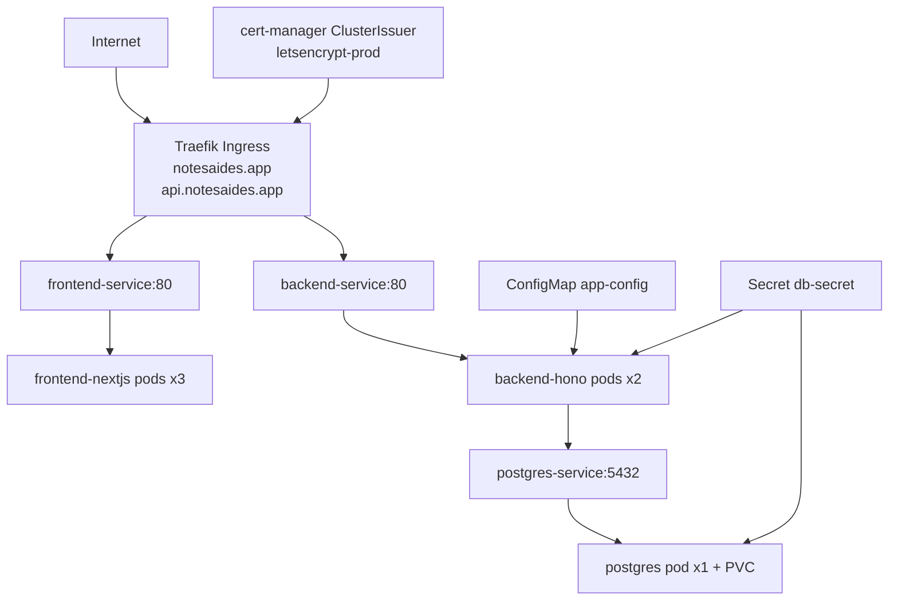
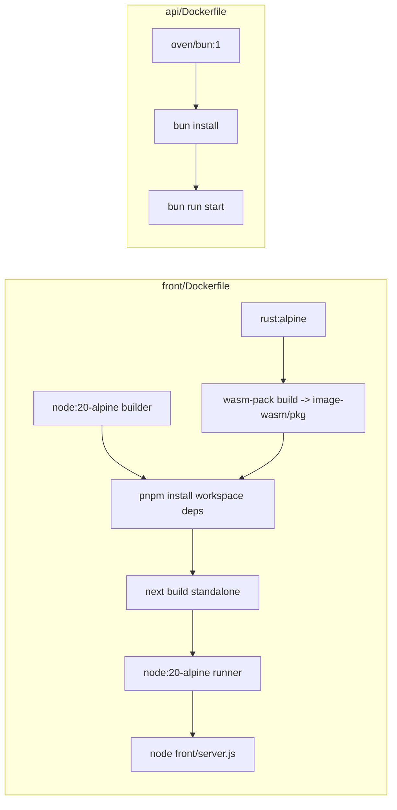

# NotesAides Architecture

Last updated: 2026-04-09
Scope: Architecture-only view (system structure, runtime flows, data model, and deployment topology).

## 1. System Context

## 2. Monorepo Architecture

```mermaid
flowchart TB
    Root[Cluster Monorepo]

    Root --> Front[front/]
    Root --> Api[api/]
    Root --> Wasm[image-wasm/]
    Root --> K3s[k3s/]

    Front --> FrontApp[App Router pages]
    Front --> FrontHooks[Hooks: useNotes/useSync/useNoteEditor/useLocalFirstNote]
    Front --> FrontComponents[Editor + Sidebar + Summary List components]
    Front --> FrontLocal[IndexedDB: notes + note_summaries + mutations + sync_meta]
    Front --> FrontServices[Notes service + local/remote repositories]
    Front --> FrontActions[Server Actions still present, but no longer primary note CRUD path]

    Api --> ApiInterface[Interface: authRoutes + routes]
    Api --> ApiUseCases[Application: Create/Update/Delete/Login/...]
    Api --> ApiDomain[Domain: Note/User contracts]
    Api --> ApiInfra[Infrastructure: Drizzle repos + websocket + db]

    Wasm --> WasmLib[src/lib.rs]
    K3s --> K3sManifests[Namespace + Security + DB + Backend + Frontend + Ingress + Issuer]
```

## 3. Runtime Component Topology (Local Dev)

## 4. Authentication and Session Flow

## 5. Local-First Note Edit and Auto-Save Flow

## 6. Real-Time Sync and Local Reconciliation Flow

## 7. Image Processing and Upload Pipeline

## 8. Data Model (Logical)

## 9. Deployment Topology (k3s)

## 10. Container Build Architecture

## 11. Architecture Decisions (Current)

- Rich note content is persisted as JSONB, not HTML.
- Frontend note UX is local-first; IndexedDB is the primary runtime read/write store for notes.
- PostgreSQL remains the source of truth after sync.
- IndexedDB separates full note bodies from lightweight note summaries to reduce client resource usage.
- Note writes are persisted in a local outbox and flushed asynchronously.
- Server fallback is still retained for cold start, missing local note detail, and reconciliation paths.
- Soft-delete is first-class (`deleted_at`), with explicit restore/permanent-delete APIs.
- Real-time sync is event-driven via websocket broadcasts scoped per user.
- Image processing is done client-side through Rust WASM for responsiveness and server offload.
- React Query remains in use, but note content no longer treats it as the primary source of truth.
- Server actions still exist, but note CRUD no longer depends on them as the primary interaction path.

## 12. Known Architecture Gaps

- Planned AI/vector-search architecture in `Prototype.md` is not yet implemented.
- Local search is summary-based and still scans in browser memory; it is improved over full-note scans but not yet a dedicated search index.
- Local-first note sync does not yet implement revision-based conflict resolution.
- The current note list windowing is simple fixed-height windowing rather than a more advanced virtualized layout system.
- Tags/folders remain more API-first than note bodies and summaries.
- Password reset token generation has no email delivery pipeline.
- Auth token is JS-readable (cookie + localStorage), not HttpOnly-session based.
- Frontend depends on generated `image-wasm/pkg`; clean environment setup requires WASM build step.

## 13. Quick Navigation

- System entrypoint: `api/src/index.ts`
- Note routes: `api/src/interface/routes.ts`
- Auth routes: `api/src/interface/authRoutes.ts`
- DB schema: `api/src/infrastructure/db/schema.ts`
- Front providers: `front/src/app/providers.tsx`
- Local note DB: `front/src/lib/notes/localDb.ts`
- Notes service: `front/src/lib/notes/notesService.ts`
- Editor core: `front/src/hooks/useNoteEditor.ts`
- Local-first detail hook: `front/src/hooks/useLocalFirstNote.ts`
- Sync hook: `front/src/hooks/useSync.ts`
- WASM exports: `image-wasm/src/lib.rs`
- k3s ingress: `k3s/05-ingress.yaml`
